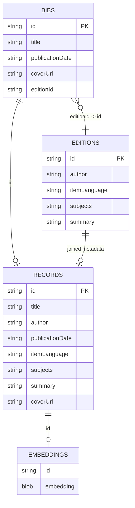

# FetchDVDs Architecture

## 1. Purpose and scope

FetchDVDs is a small library-catalog similarity-search application. Despite the
repository name, the current Vega query is configured for a specific collection
of print books at a specific library location. The application has two principal
jobs:

1. Build and incrementally synchronize a local catalog from the public-facing
   Vega discovery API.
2. Let a user enter a natural-language query, embed that query with OpenAI, find
   the nearest catalog embeddings in SQLite, and display the matching titles in
   a Flask web page.

The codebase is a small monolith. Its web layer is organized as the importable
`flaskr` package, while synchronization, integration, configuration, maintenance
scripts, and the database remain at the repository root. There is no separate
API tier, task queue, or migration framework. A Phase 1 characterization suite
covers the current integration boundaries and core behavior.

This document describes the code as it currently exists. Where older notes
describe intended behavior that differs from the implementation, the behavior
in the Python source is treated as authoritative.

## 2. System context

The program has two independently started runtime paths. They share
`items.db`, but otherwise perform different work.

### 2.1 Database synchronization path

Running `sync_db.py` fetches catalog data, updates the relational tables,
rebuilds the searchable record table, and creates embeddings for new records.

The path proceeds as follows:

- `sync_db.py` opens the local `items.db` file and loads the sqliteai-vector
  extension.
- It calls `fetch_items.py` to retrieve bibliographic format-group records from
  the III Vega API. New IDs are inserted into `bibs`, and IDs no longer returned
  by Vega are deleted.
- It reads edition IDs from `bibs`, fetches metadata for editions that are not
  already stored, and synchronizes the `editions` table.
- It drops and rebuilds `records` by joining `bibs` with `editions`. This
  flattened table contains the catalog fields used by search and the web UI.
- It compares IDs in `records` with IDs in `embeddings`. Embeddings without a
  corresponding record are deleted.
- For records without embeddings, it combines the catalog fields into text and
  sends that text to the OpenAI Embeddings API using
  `text-embedding-3-small`.
- The returned 1,536-dimensional vectors are stored in `embeddings` and indexed
  through sqliteai-vector.

The resulting SQLite database is the handoff point between synchronization and
the web application. Existing record IDs are treated as unchanged, so their
metadata and embeddings are not refreshed when only their upstream content
changes.

### 2.2 Flask/Gunicorn web request path

Gunicorn serves the Flask application. The `/` route only renders the initial
search form. A `/search` request proceeds as follows:

- The browser sends a GET request such as `/search?query=historical+fiction` to
  Gunicorn, which is configured with four workers on port `8001`.
- Gunicorn passes the request to the `/search` route in
  `flaskr/__init__.py`.
- Flask extracts the `query` parameter and opens `items.db` through
  `sync_db.create_con`, which also loads the vector extension.
- The query text is sent to the OpenAI Embeddings API using the same model used
  for catalog records.
- `sync_db.sim_search` compares the query vector with vectors in `embeddings`
  and selects the 100 nearest record IDs.
- SQLite joins those IDs to `records` and orders the rows by vector distance.
- The rows are converted to dictionaries and passed to
  `flaskr/templates/results.html`.
- Jinja renders the result cards, `flaskr/static/style.css` supplies their
  styling, and Gunicorn returns the completed HTML response to the browser.

The web path reads the catalog and embeddings produced by synchronization. It
does not contact Vega or update catalog records. It does make a new OpenAI API
request for every search.

## 3. Repository file map

| Path | Role |
| --- | --- |
| `flaskr/` | Importable Flask web package containing the application module, Jinja templates, and static assets. |
| `flaskr/__init__.py` | Creates the Flask application and defines its HTTP routes. It renders the search form and executes searches through `sync_db.py`. |
| `flaskr/templates/index.html` | Jinja template for the landing page and search form. |
| `flaskr/templates/results.html` | Jinja template for result cards, metadata, summaries, cover images, and links back to Vega catalog records. |
| `flaskr/static/style.css` | Responsive styling for the landing page, fixed results header, search controls, and result cards. |
| `sync_db.py` | Core application module. Owns SQLite/vector-extension setup, catalog synchronization, table derivation, embedding creation, vector search, and conversion of SQL rows for templates. It is also the main synchronization entry point. |
| `fetch_items.py` | Asynchronous Vega API client and response parser. Fetches bibliographic format groups and edition metadata. It can also run alone as a fetch/count diagnostic. |
| `query.py` | Manual database inspection and repair utilities. It contains destructive migration/deduplication helpers and is not part of normal web or sync execution. Its current main block prints edition-language counts. |
| `embed.py` | Older standalone embedding experiment. The production embedding path is now in `sync_db.py`; this script is currently incompatible with the current `get_collection` signature. |
| `gunicorn.conf.py` | Gunicorn settings: bind on all interfaces at port `8001`, use four workers, and send access logs to standard output. |
| `pyproject.toml` | Project metadata, exact direct dependencies, supported Python version, and Ruff configuration. |
| `requirements.txt` | Exact production dependency versions mirrored from `pyproject.toml` for the current deployment workflow. |
| `Makefile` | Deterministic `test`, `lint`, and combined `check` commands. |
| `tests/` | Offline characterization tests for Vega parsing, synchronization/database behavior, embeddings, vector ordering, Flask routes, and backup/restore. |
| `tests/fakes.py` | Deterministic fake HTTP and OpenAI clients used to prevent tests from making external requests. |
| `tests/fixtures/` | Saved representative Vega JSON responses. |
| `scripts/database_backup.py` | Refuse-overwrite SQLite integrity, backup, and restore command-line utility. |
| `docs/DATABASE_BACKUP.md` | Operator procedure for verified backup, test restore, and failure recovery. |
| `docs/BASELINE.md` | Phase 1 snapshot of dependencies, schema, row relationships, and behavior protected by tests. |
| `.env` | Local, ignored environment configuration. The current code expects `OPENAI_API_KEY`; its value must remain secret. |
| `.gitignore` | Python-oriented ignore rules plus project rules for the large database, local documentation, virtual environments, logs, and test scratch files. |
| `.codex` | Empty tracked repository metadata placeholder; it has no runtime role. |
| `items.db` | Ignored runtime SQLite database. It contains catalog, derived record, embedding, and vector-extension tables. The file is opened by relative path, so the process working directory matters. |
| `history.log` | Ignored runtime log written by `sync_db.py` through a relative-path `FileHandler`. |
| `.venv/` | Ignored local Python virtual environment. It is development state, not application source. |
| `README.md` | Short, ignored project overview and basic file map. |
| `README_OLD.md` | Older, ignored overview that mentions combined semantic and keyword search; the current implementation performs semantic vector search only. |
| `INSTRUCTIONS.md` | Ignored machine-specific operations notes for systemd, cron, and a planned Cloudflare tunnel. These external service definitions are not stored in this repository. |
| `TODO.md` | Ignored backlog covering filters, language display, location display, query performance, and hosting. |
| `ARCHITECTURE.md` | This architecture reference. |

There is not yet a transitive dependency lockfile, CI workflow, container
definition, or versioned database migration framework.

## 4. Organization and module boundaries

The program is organized into four informal layers:

| Layer | Files | Responsibilities |
| --- | --- | --- |
| Presentation | `flaskr/` | HTTP routing, input extraction, HTML rendering, layout, and browser-facing links. |
| Application/domain workflow | `sync_db.py` | Orchestrates synchronization and search; derives records and embedding input text. |
| Integration | `fetch_items.py`, OpenAI calls in `sync_db.py` | Talks to Vega and OpenAI and adapts remote responses into local tuples/vectors. |
| Persistence | SQLite calls in `sync_db.py` and `query.py` | Stores normalized and derived catalog data and invokes sqliteai-vector functions. |

The boundaries are conventions rather than enforced interfaces. For example,
`sync_db.py` mixes orchestration, SQL, OpenAI calls, logging, schema migration,
and search logic. Functions accept raw SQLite connection/cursor objects and pass
plain tuples, sets, lists, and dictionaries rather than domain objects.

Imports form a simple dependency graph:

```text
flaskr/__init__.py -> sync_db.py ------> fetch_items.py
query.py -------> sync_db.py
embed.py -------> sync_db.py

flaskr/templates/ and flaskr/static/ are loaded by Flask
sync_db.py and fetch_items.py call external services directly
```

There are no circular imports.

## 5. Data model

### 5.1 Application tables

SQLite columns are declared without explicit SQL types except for embedding
BLOBs. SQLite therefore relies heavily on dynamic typing.

| Table | Columns | Source and purpose |
| --- | --- | --- |
| `bibs` | `id` (primary key), `title`, `publicationDate`, `coverUrl`, `editionId` | One row per Vega format group. Holds the fields returned by the catalog search endpoint and points to the first edition exposed in the first material tab. |
| `editions` | `id` (primary key), `author`, `itemLanguage`, `subjects`, `summary` | One row per fetched Vega edition. Multi-valued fields are flattened into comma-separated text. |
| `records` | `id` (primary key), `title`, `author`, `publicationDate`, `itemLanguage`, `subjects`, `summary`, `coverUrl` | Rebuilt during every sync as an inner join of `bibs` and `editions`. This is the read model used by search and templates. |
| `embeddings` | `id`, `embedding` (BLOB) | Maps a record ID to its OpenAI embedding. `ensure_embeddings_table` can create this table without a primary key and can migrate a legacy column named `BLOB` to `embedding`; the local database has separately been migrated to a primary-key version. |

The logical relationships are:



The relationship is not enforced with SQLite foreign keys. `records` is a
materialized read table, not a SQL view, and is dropped/recreated during sync.

### 5.2 Vector-extension tables

`create_con` loads the native `sqlite_vector` extension distributed by the
`sqliteai-vector` Python package. Calls to `vector_init` and `vector_quantize`
create or maintain extension-owned metadata and quantized-vector storage. In the
current local database these include `_sqliteai_vector` and
`vector0_embeddings_embedding`. Application code should treat these as internal
implementation details and use the extension functions instead of editing them.

### 5.3 Local database snapshot

At the time this document was written, the ignored local `items.db` was roughly
591 MiB and contained 20,326 rows in each of `bibs`, `editions`, `records`, and
`embeddings`. It also contained legacy tables left by manual migrations in
`query.py`. These values describe one workstation snapshot, not a guaranteed
production state or schema invariant.

## 6. Catalog synchronization

Running `python sync_db.py` executes the following sequence:

```text
create_con
  -> load sqliteai-vector extension
  -> sync
       -> bibs
       -> editions
       -> join_tables
       -> sync_embeddings
```

### 6.1 Connection and startup behavior

Importing `sync_db.py` loads `.env`, configures logging, opens `history.log`, and
suppresses most `httpx` logs. `create_con` then:

1. Opens `items.db` relative to the current working directory.
2. Resolves the packaged native vector library with `importlib.resources`.
3. Temporarily enables SQLite extension loading.
4. Loads the vector library and disables further extension loading.
5. Returns a raw `(connection, cursor)` tuple.

The code does not configure WAL mode, busy timeouts, foreign keys, row factories,
or explicit connection cleanup.

### 6.2 Bibliographic synchronization

`bibs` asks `fetch_items.fetch_all_bibs` for all matching catalog format groups.
The fetcher divides the search into the year range 1-1999 and one request group
per year from 2000 through the current year. For each range it first requests a
page count, then schedules every page concurrently.

The Vega search request is hard-coded to:

- search text `*`;
- sort by title ascending;
- search type `everything`;
- universal limiter `at_library`;
- material type ID `1`;
- location ID `59`;
- page size 100;
- `FormatGroup` resources;
- the `slouc.na2.iiivega.com` customer/host domain.

The response parser stores the format-group ID, title, publication date, medium
cover URL, and the first edition ID found in the first material tab.

Synchronization is ID-based:

- API IDs missing locally are inserted.
- Local IDs missing from the API response are deleted.
- IDs present in both sets are counted as unchanged and are not updated.

### 6.3 Edition synchronization

`editions` compares the edition IDs referenced by `bibs` with IDs in the local
`editions` table. Obsolete edition rows are deleted. New IDs are fetched in
batches of up to 100, with at most five edition-fetch coroutines intended to be
active at once.

`fetch_edition` extracts:

- authors, joined with commas;
- item-language codes, joined with commas;
- every edition field whose name starts with `subj`, flattened and joined;
- summary notes, joined with commas.

`get_lang` contains a small language-code mapping but is not called, so stored and
displayed languages remain the raw values returned by Vega.

### 6.4 Derived records table

`join_tables` drops the previous `records` table, creates it again, and inserts an
inner join between `bibs.editionId` and `editions.id`. A bibliographic row without
a corresponding edition is therefore absent from the searchable read model.

### 6.5 Embedding synchronization

`sync_embeddings` compares IDs in `records` and `embeddings`:

- embeddings without a record are deleted;
- records without an embedding are converted to labeled text and embedded;
- IDs in both tables are left unchanged.

The embedding input is a concatenation of title, author, publication date,
language, subjects, and summary. The fixed model is
`text-embedding-3-small`. Embeddings are requested asynchronously in batches of
up to 100, converted to a string representation, parsed by
`vector_as_f32`, and stored as FLOAT32 BLOBs.

The model currently produces 1,536 dimensions, which matches the dimension
hard-coded in the search initialization. Changing the model or requested
dimensions requires rebuilding stored embeddings and updating the search
configuration together.

The sync commits after several individual steps and each batch. It is not one
atomic transaction, so a failure can leave a partially updated database that a
later run must reconcile.

## 7. Search request flow

### 7.1 Routes

`flaskr/__init__.py` exposes two GET routes:

| Route | Behavior |
| --- | --- |
| `/` | Renders `flaskr/templates/index.html`, which contains a query form. |
| `/search?query=...` | Reads `query` (defaulting to `Flask` if absent), performs semantic search, converts rows to dictionaries, and renders `flaskr/templates/results.html`. |

### 7.2 Query processing

For every `/search` request:

1. `sync_db.create_con` opens the relative `items.db` and loads the vector
   extension.
2. `embed_query` sends the user text to OpenAI using
   `text-embedding-3-small`.
3. `sim_search` serializes the 1,536-element query vector as JSON.
4. SQLite initializes the embeddings vector column and quantizes stored vectors.
5. A connection-local temporary table named `nearest_neighbors` is recreated.
6. `vector_quantize_scan` selects the 100 nearest embedding row IDs and their
   distances.
7. Those neighbors are joined to `records` and ordered by ascending distance.
8. `sql_to_json` maps the record columns to dictionaries for Jinja.
9. The result template displays the cover, title, author, publication date,
   language, subjects, and expandable summary.

The Vega record link is constructed from the format-group ID and opens in a new
tab. Jinja's normal HTML autoescaping applies to template values.

Although the older README describes a combination of semantic and keyword
search, there is no keyword or full-text-search stage in the current query path.
The returned vector distance is also discarded during dictionary conversion and
is not shown to the user.

## 8. Configuration and external dependencies

### 8.1 Environment

The OpenAI Python client discovers `OPENAI_API_KEY` from the environment after
`python-dotenv` loads the repository's `.env` file. No other environment-based
application settings are currently read.

The following settings are hard-coded in source:

- Vega URLs, domain headers, anonymous-user IDs, filters, and pagination;
- the OpenAI model name and vector dimension;
- `items.db` and `history.log` relative paths;
- nearest-neighbor result count of 100;
- request concurrency of five in the fetcher;
- Gunicorn bind address, port, and worker count.

### 8.2 Python and native dependencies

The code requires a modern Python version; `int | None` syntax makes Python 3.10
or later the practical minimum. The current virtual environment uses Python
3.13.

Direct runtime dependencies used by source are:

- Flask and Gunicorn for web serving;
- httpx for Vega HTTP requests;
- openai for synchronous query embeddings and asynchronous catalog embeddings;
- python-dotenv for `.env` loading;
- sqliteai-vector for its packaged SQLite extension and vector SQL functions;
- tqdm for asynchronous and batch progress reporting.

`pyproject.toml` and `requirements.txt` pin the tested direct dependencies,
including `tqdm`. The previously declared third-party `asyncio`, `requests`, and
`sqlalchemy` packages are not direct application dependencies. There is still no
transitive dependency lockfile, so a fresh installation can resolve different
indirect dependency versions.

### 8.3 Remote-service assumptions

The program assumes that:

- the unauthenticated Vega endpoints and browser-like request headers continue
  to work and retain their current JSON shapes;
- Vega IDs remain stable and edition metadata can be represented as flattened
  strings;
- the configured material/location IDs retain their meaning;
- the OpenAI API key is valid and has quota;
- `text-embedding-3-small` remains available and compatible with the stored
  vectors;
- outbound HTTPS is allowed from both batch and web processes.

## 9. Deployment and operations

The repository's Gunicorn configuration expects an invocation equivalent to:

```bash
gunicorn --config gunicorn.conf.py
```

It binds to `0.0.0.0:8001` with four default synchronous workers. Local notes say
a systemd unit named `simsearch.service` starts Gunicorn via a script outside the
repository, and mention a Cloudflare tunnel. Those files are machine-local and
cannot be validated from this repository.

The same notes say cron runs `fetch_items.py`; however, that module's main block
only fetches catalog records and prints a count. A full database refresh requires
running `sync_db.py`. The installed cron entry should therefore be checked before
assuming unattended synchronization is active.

All processes that need the same database and log must start with the repository
root as their working directory. Otherwise the relative paths may create or open
a different `items.db` and `history.log`. The unused `DATABASE = '/items.db'`
constant in `flaskr/__init__.py` does not control the active search connection.

## 10. Assumptions and invariants

Correct behavior currently depends on these implicit invariants:

- `bibs.id`, `editions.id`, `records.id`, and `embeddings.id` refer to the same
  stable catalog identity chain expected by the join/diff logic.
- Every searchable record has non-null string values for all fields concatenated
  by `get_collection`; otherwise string concatenation can fail.
- Stored embeddings and query embeddings use the same model and dimension.
- The order of columns in `records` matches the dictionaries constructed by
  `sql_to_json`.
- SQLite was built with extension-loading support and can load the platform
  binary packaged by `sqliteai-vector`.
- Only one authoritative synchronization job modifies the database at a time.
- The working directory contains a populated database before the web application
  accepts searches.
- Vega pagination treats the requested page range in the same way the current
  `range(0, total_pages + 1)` logic expects.
- A single format group's first material tab and first edition are the edition
  intended for indexing.

## 11. Limitations and risks

### 11.1 Data correctness and freshness

- Existing IDs are never updated. A title, cover URL, publication date, author,
  subject, language, or summary changed upstream remains stale until the local
  row is removed/rebuilt manually.
- Embeddings are refreshed only when an ID is absent. Metadata changes under the
  same ID would not trigger re-embedding even if the relational update behavior
  were improved.
- `records` uses an inner join and silently excludes bibliographic records whose
  edition row is missing.
- Only the first edition from the first material tab is selected.
- Language values are not normalized even though a partial mapping exists.
- Subjects and summaries are flattened, losing their original structure.
- The code relies on dynamically typed columns and does not enforce foreign keys.
- The embedding text builder assumes non-null strings and contains the label
  typo `lanugage`; the typo becomes part of every newly generated embedding
  input.

### 11.2 Error handling and recovery

- Vega calls use `timeout=None`, have no retries/backoff, and call
  `raise_for_status`; one failed coroutine can abort a batch.
- A new `httpx.AsyncClient` is created for each request, preventing connection
  pooling across calls.
- In `fetch_bibs`, the semaphore is released before the HTTP request, so the
  intended five-request limit does not actually bound bibliographic page
  requests.
- Sync uses many commits rather than an atomic transaction. Failures can expose a
  partially rebuilt catalog.
- SQL `IN` clauses are built by interpolating Python tuples in several places.
  Singleton tuples can produce invalid SQL, and parameterization is inconsistent.
- A brand-new database can fail in `sync_embeddings` because it queries
  `embeddings` before ensuring that the table exists.
- Connections created during sync and request handling are generally not closed
  explicitly. `get_embeddings` also opens an unused connection.
- There is no structured error page, health check, or degraded behavior when
  OpenAI, Vega, SQLite, or the extension fails.

### 11.3 Search quality and performance

- Search is semantic-only; there is no exact, keyword, phrase, spelling, filter,
  or hybrid ranker.
- The result count is fixed at 100 and users cannot paginate or filter it.
- Every query incurs an external OpenAI request, adding latency and cost.
- Vector initialization and quantization are invoked on every search request;
  doing this once during indexing would likely be more efficient.
- The query path is synchronous from Flask's perspective, so each worker remains
  occupied while waiting for OpenAI and SQLite.
- Four Gunicorn workers share one SQLite file. Concurrent reads plus sync-time
  writes may cause locking or inconsistent availability because WAL/busy-timeout
  behavior is not configured.
- There is no query/result cache or precomputed query normalization.

### 11.4 Security and abuse resistance

- The web application has no authentication, authorization, rate limiting,
  request-size limit, or usage quota. If exposed publicly, arbitrary users can
  consume OpenAI API quota.
- Vega browser headers and anonymous identifiers are hard-coded and may be
  brittle or inappropriate for long-term server integration.
- Several maintenance helpers in `query.py` interpolate table names/ID tuples
  and perform destructive schema changes. They should only be run with trusted
  inputs and a database backup.
- The service binds to all network interfaces. Network exposure must be
  controlled by the host firewall, reverse proxy, or tunnel configuration.
- Secrets are correctly excluded through `.gitignore`, but there is no documented
  key rotation or secret-management mechanism beyond `.env`.

### 11.5 Maintainability and observability

- `sync_db.py` combines too many responsibilities and has no typed repository or
  service interfaces.
- `embed.py` is stale and does not run with the current `get_collection` API.
- `flaskr/__init__.py` defines an unused Flask `g` connection helper and an
  unused absolute database path; the actual search connection bypasses teardown
  cleanup.
- `sim_search` converts its rows to JSON-like dictionaries and discards that
  value, after which `flaskr/__init__.py` performs the same conversion again.
- `sql_to_json` prints schema column names on every request.
- Logging configuration happens at import time and can add file handlers in
  worker processes. Logs are plain text with no rotation configured in source.
- The Phase 1 suite provides offline characterization tests, saved API fixtures,
  real in-memory vector-search coverage, Ruff checks, and backup/restore tests.
  It does not yet cover a complete synchronization run, production-scale
  concurrency, or versioned schema migrations, and there is no CI gate.
- Runtime and deployment documentation is partly ignored by Git, so it may not
  travel with the source or remain consistent across hosts.

## 12. Safe extension points

Future changes are easiest to reason about if they preserve these boundaries:

- Put Vega request/response changes in `fetch_items.py`, ideally behind one
  reusable `AsyncClient` and explicit retry/timeout policy.
- Keep schema creation and migrations separate from routine synchronization, and
  add a versioned migration mechanism before changing table layouts.
- Treat `records` as a deliberate read model and rebuild embeddings whenever the
  canonical embedding text changes, not only when IDs change.
- Move OpenAI/vector operations behind a small search/index service so model,
  dimensions, batching, and retry behavior are configured in one place.
- Add filters to parameterized SQL over `records` before or after vector
  candidate selection, depending on whether filter-first recall is required.
- Centralize application settings for paths, Vega filters, model, dimensions,
  result count, and concurrency in environment-backed configuration.
- Expand the existing fake-client and temporary-database tests to cover a full
  synchronization transaction and future versioned migrations.

Any schema or embedding-input change should be treated as an index migration:
create or update relational data, rebuild all affected embeddings with one model
configuration, initialize/quantize the vector index, validate counts, and only
then expose the updated database to web workers.
